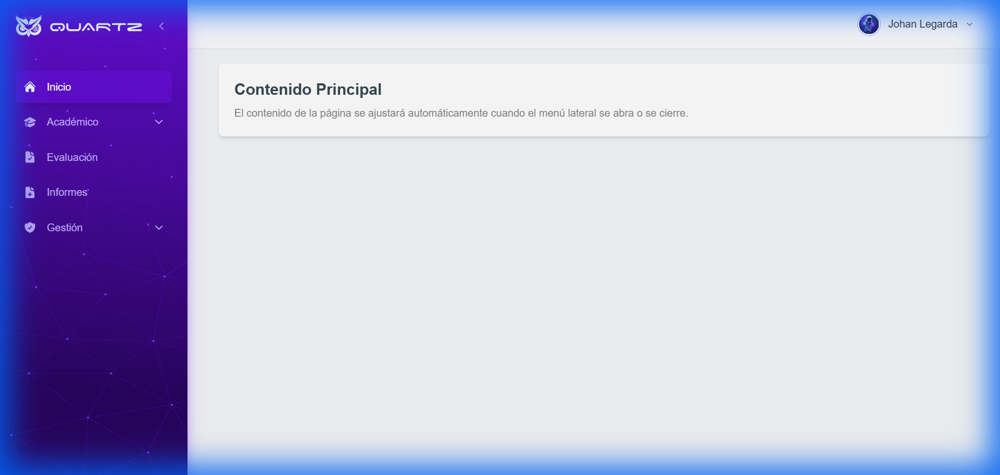
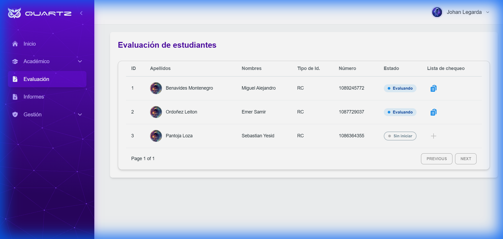
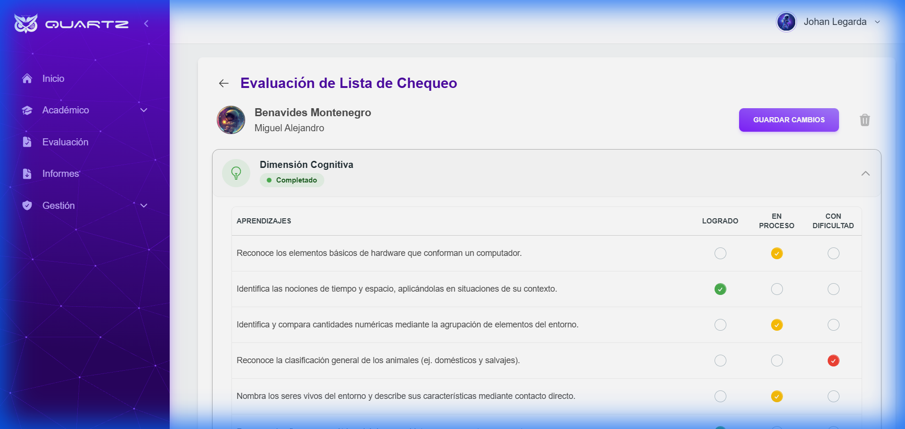

# Quartz

Plataforma de gestión académica e institucional diseñada para optimizar los procesos de evaluación y seguimiento estudiantil.

## 🚀 Características Principales

### 1. Panel de Control (Dashboard)
Una vista centralizada que ofrece acceso rápido a los módulos principales del sistema, como gestión académica, informes y configuración de usuarios.


### 2. Gestión de Evaluaciones
Permite a los docentes realizar el seguimiento académico de los estudiantes de manera eficiente, visualizando el estado de las valoraciones por asignatura.


### 3. Evaluación Detallada (Lista de Chequeo)
Interfaz intuitiva para la valoración de aprendizajes específicos. Incluye:
-   **Indicadores de estado**: Colores dinámicos para distinguir asignaturas completadas, en progreso o pendientes.
-   **Protección de datos**: Sistema de guardado y alertas para evitar la pérdida de cambios no guardados.
-   **Navegación fluida**: Diseño optimizado para facilitar la carga de notas.


## 🛠️ Tecnología

Este proyecto está construido con:
-   **React** (Vite)
-   **TypeScript**
-   **Tailwind CSS** (@material-tailwind/react)
-   **Zustand** (Gestión de estado)
-   **React Router Dom** (Enrutamiento avanzado)

## 📦 Instalación y Uso

1.  Clonar el repositorio.
2.  Instalar dependencias:
    ```bash
    npm install
    ```
3.  Iniciar el servidor de desarrollo:
    ```bash
    npm run dev
    ```
